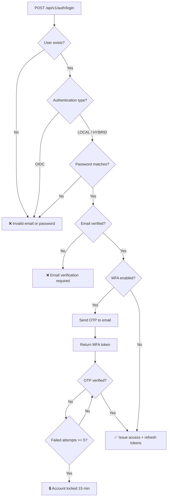
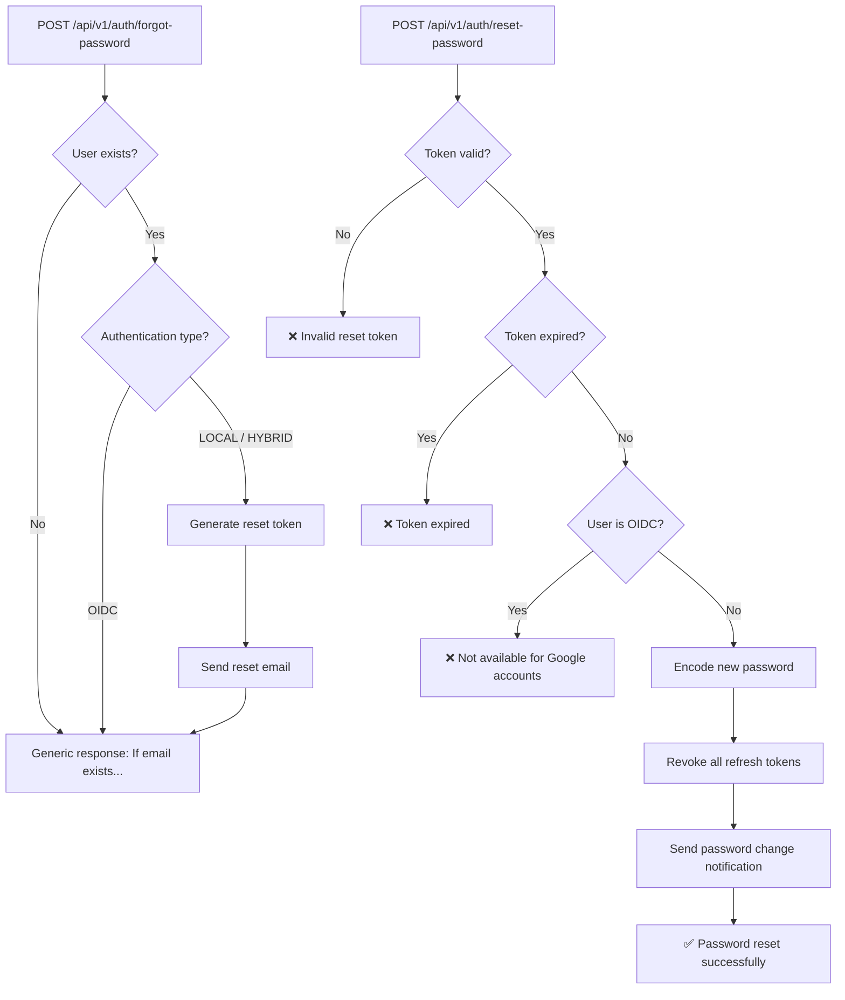
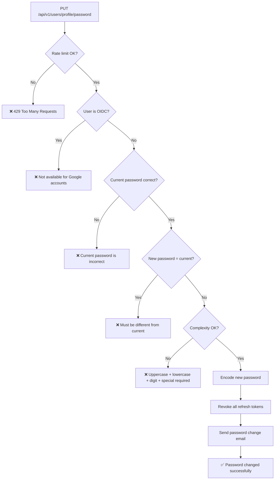
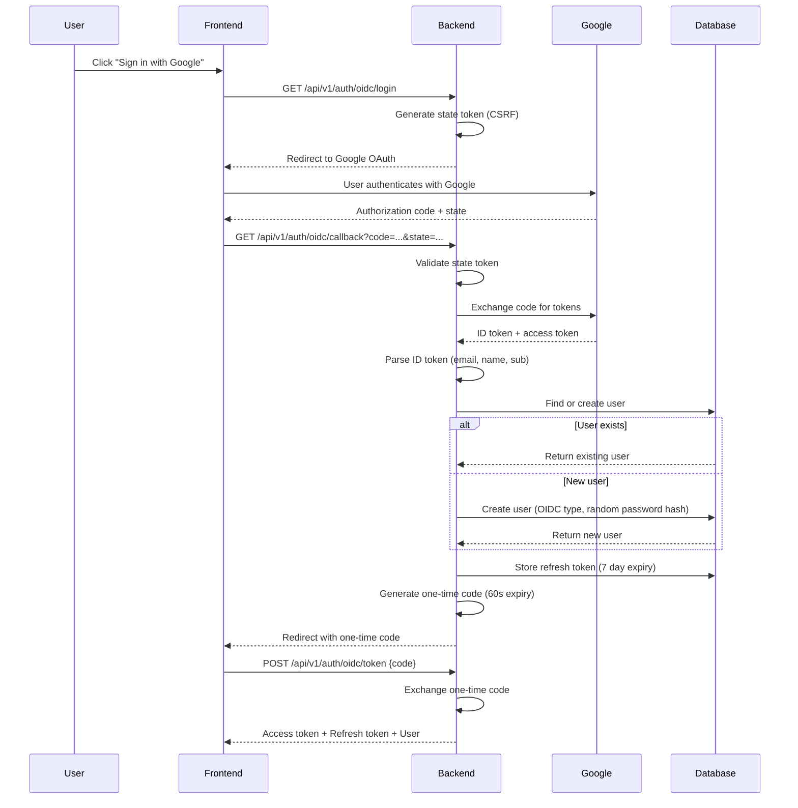
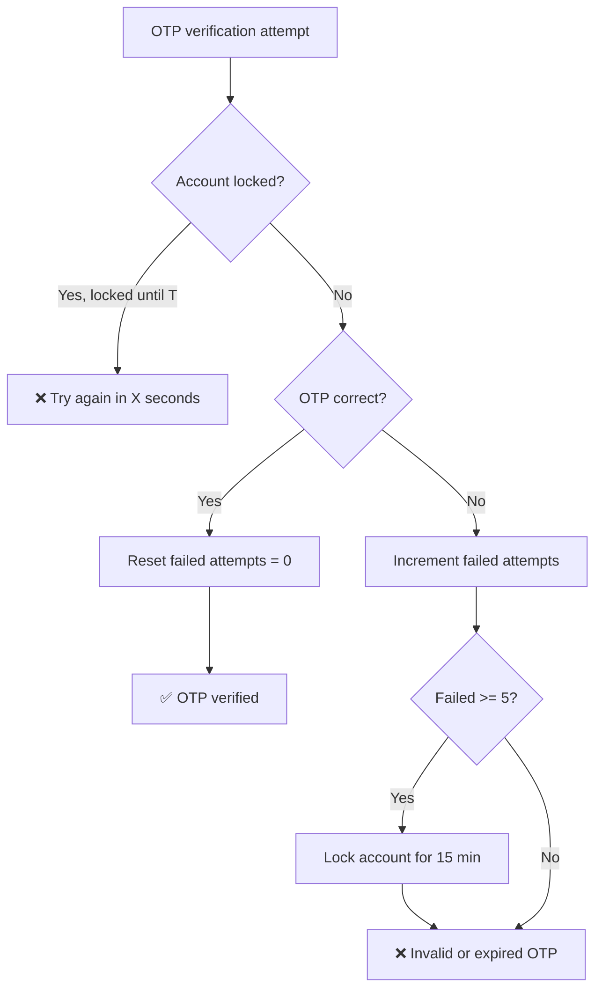
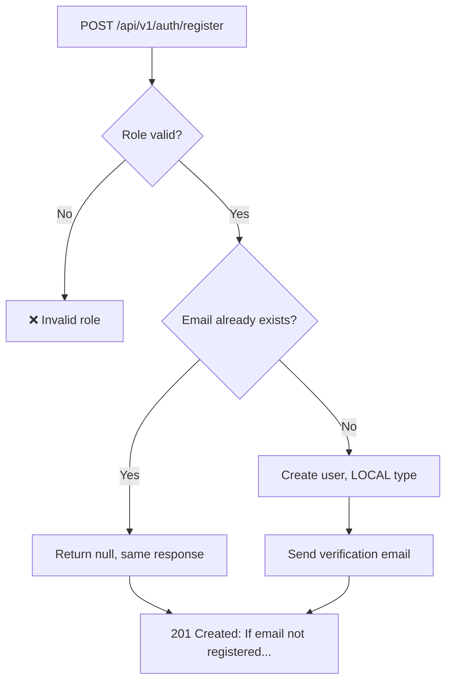

# Authentication Security Flow

## Login Flow

## Password Reset Flow

## Change Password Flow (Authenticated)

## OIDC Login Flow

## MFA Brute-Force Protection

## Registration Flow (Enumeration Protected)

